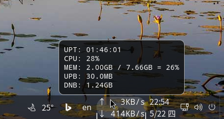

# CMUD_GNOME
Display uptime, cpu, memory, upload, download on GNOME taskbar.  

## Changelog
### V1.0 (2025-04-22)
Display uptime, cpu, memory, upload, download on GNOME taskbar. 

## Reference
[guide](https://gjs.guide/extensions/development/creating.html)  
[Cinnamon_Applet](https://github.com/sonichy/Cinnamon_Applet)
