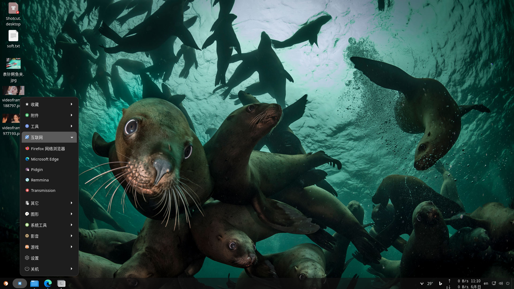

# StartMenu_GNOME
Display start menu on GNOME taskbar.  

## Changelog
### V1.0 (2025-06-01)
Display start menu on GNOME taskbar.

## Reference
[Guide](https://gjs.guide/extensions/development/creating.html)  
[BingWallpaper](https://extensions.gnome.org/extension/8081/bing-wallpaper/)
[ArcMenu](/usr/share/gnome-shell/extensions/arcmenu@arcmenu.com)

## Debug
dbus-run-session -- gnome-shell --nested --wayland
