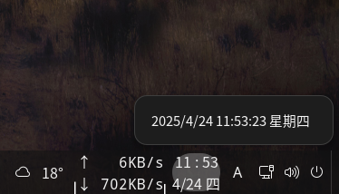

# Datetime_GNOME
Display date and time on GNOME taskbar.  

## Changelog
### V1.0 (2025-04-22)

## Reference
[guide](https://gjs.guide/extensions/development/creating.html)
[Cinnamon_Applet](https://github.com/sonichy/Cinnamon_Applet)

## Debug
dbus-run-session -- gnome-shell --nested --wayland
