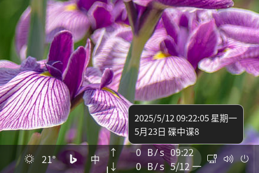

# Datetime_GNOME
Display date and time on GNOME taskbar.  

## Changelog
### V1.1 (2025-05-12)
Support set memo text in tooltip.
### V1.0 (2025-04-22)
Display date and time on GNOME taskbar.

## Reference
[Guide](https://gjs.guide/extensions/development/creating.html)  
[Cinnamon_Applet](https://github.com/sonichy/Cinnamon_Applet)  
[Calendar](https://gitlab.gnome.org/GNOME/gnome-shell/-/blob/main/js/ui/dateMenu.js#L901)  
[Tooltip](https://gitlab.com/arcmenu/ArcMenu)  
[Dialog](https://gjs.guide/extensions/topics/dialogs.html)  
[Settings](https://gjs.guide/extensions/development/preferences.html)
[Settings](https://gjs.guide/guides/gtk/3/16-settings.html#title:-application-settings)

## GSettings schema must be compiled
`glib-compile-schemas schemas/`

## Debug
dbus-run-session -- gnome-shell --nested --wayland  
dconf-editor
